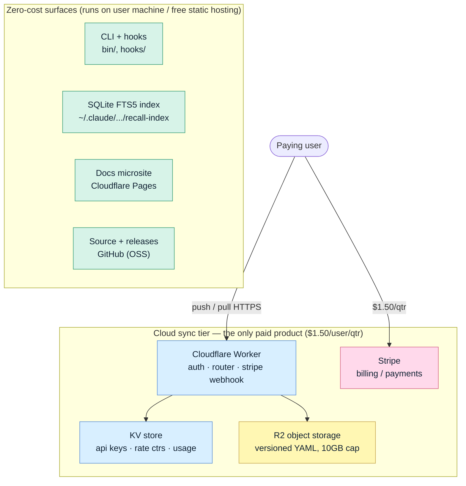
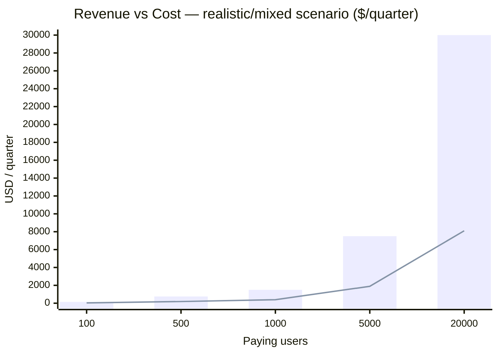
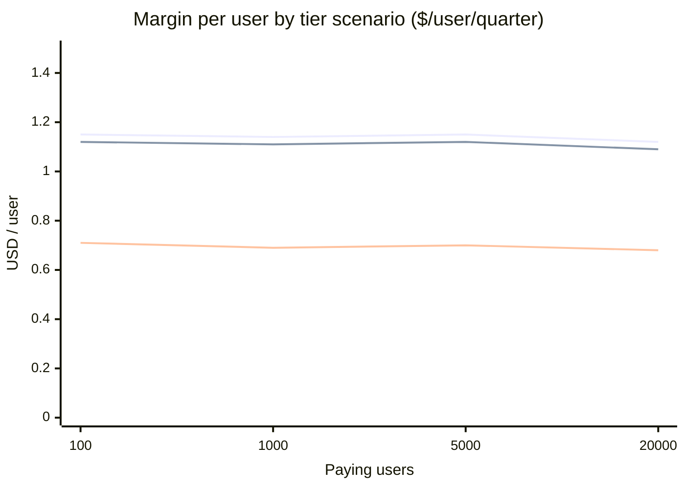
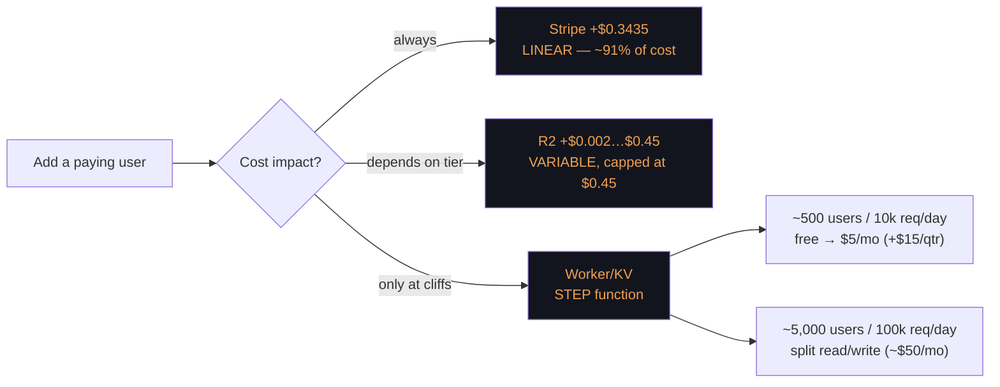

# recall — Financial Projection by Architecture Component

*Generated via `/cheaploop`. Quarterly figures unless noted. Basis: `docs/cloud-spec.html` (v1, 2026-03-30) + standard Cloudflare/Stripe list pricing.*

Two things to hold onto before the numbers:

1. **Only one tier of recall costs money to operate.** The CLI, hooks, and SQLite index run on the *user's* machine; the docs microsite and repo are free static hosting. The only cost-bearing surface is the **cloud sync tier** (Cloudflare Worker + R2 + KV + Stripe).
2. **There is zero LLM cost to the project.** Extraction/restart distillation runs inside the user's own coding agent (Claude Code / Codex / Gemini). recall never calls a model API, so no token bill scales with usage.

---

## 1. Cost map — what each component costs, and how it scales

| Legend | Cost behavior | Components |
|---|---|---|
| 🟩 Zero | $0 — user-side or free static hosting | CLI, hooks, SQLite index, Pages docs, GitHub |
| 🟪 Linear | Grows $/paying-user, **usage-independent** | **Stripe fee — $0.3435/user/qtr** |
| 🟨 Storage | Variable per user, **hard-capped** | **R2 — $0.002 (Lite) → $0.45 (Full, 10GB cap)** |
| 🟦 Step | Flat until a request-volume cliff | **Worker + KV — $0 → $15/qtr → ~$150/qtr** |

---

## 2. Per-component unit economics (per paying user / quarter)

| Component | Cost basis | Unit cost | Scales with | Ceiling |
|---|---|---|---|---|
| Stripe fee | 2.9% + $0.30 per txn | **$0.3435** | # paying users (linear) | none — pure linear |
| R2 storage | $0.015 / GB-month × 3 | $0.002 → **$0.45** | data stored (tier) | $0.45 (10GB cap) |
| Worker compute | free 100k req/day, then $5/mo flat | ~$0.01 amortized | request volume (step) | see §4 cliffs |
| KV ops | folds into Worker plan | ~$0 | rate-limit checks | negligible |
| Docs / GitHub / subdomain | free static hosting | $0 | — | $0 (custom domain +~$2.50/qtr opt.) |
| **LLM / model API** | runs on user's own agent | **$0** | — | never billed to project |
| **Revenue** | subscription | **+$1.50** | # paying users | — |

Spec's own tally (worst-case Full tier): Stripe $0.34 + R2 $0.45 + Worker $0.01 = **$0.80 cost → $0.70 profit/user**. Reproduced exactly below.

---

## 3. Scenario projections — cost & profit vs scale

Three tier-mix scenarios (the storage tier is the only real margin lever):

- **Optimistic** — all users on **Lite** (default; distilled restarts only, ~2–5 KB/session)
- **Realistic** — **mixed** 80% Lite / 15% Standard / 5% Full
- **Worst case** — all users on **Full** (10 GB cap saturated = spec's conservative number)

### Realistic (mixed) — quarterly

| Paying users | Revenue | Stripe | R2 | Worker/KV | Total cost | **Profit** | Margin/user |
|--:|--:|--:|--:|--:|--:|--:|--:|
| 100 | $150 | $34 | $3 | $0 | $38 | **$113** | $1.12 |
| 500 | $750 | $172 | $16 | $0 | $188 | **$563** | $1.12 |
| 1,000 | $1,500 | $344 | $32 | $15 | $390 | **$1,110** | $1.11 |
| 5,000 | $7,500 | $1,718 | $158 | $15 | $1,891 | **$5,610** | $1.12 |
| 20,000 | $30,000 | $6,870 | $632 | $600 | $8,102 | **$21,898** | $1.09 |

### Margin/user by scenario (the punchline)

| Users | Optimistic (Lite) | Realistic (mixed) | Worst (Full) |
|--:|--:|--:|--:|
| 100 | $1.15 | $1.12 | $0.71 |
| 1,000 | $1.14 | $1.11 | $0.69 |
| 5,000 | $1.15 | $1.12 | $0.70 |
| 20,000 | $1.12 | $1.09 | $0.68 |

**Margin per user is nearly flat across scale.** It barely moves from 100 → 20,000 users. The only thing that meaningfully changes it is the *storage tier mix* ($1.12 → $0.70), not user count.

*Bars = revenue, line = total operating cost. The gap (profit) widens with every user; cost stays a thin sliver.*

*Top line = all-Lite, middle = mixed, bottom = all-Full. Flat lines ⇒ margin is scale-independent; the vertical gap between lines is the entire story: storage tier is the only lever.*

---

## 4. Which costs scale, and where the cliffs are

**Cost composition at 5,000 users (mixed):** total ≈ $1,891/qtr
- Stripe **$1,718 (90.8%)** ← the whole cost curve is basically Stripe
- R2 $158 (8.4%)
- Worker/KV $15 (0.8%)

**Sensitivity — what actually moves the P&L:**

| Lever | Effect on cost | Notes |
|---|---|---|
| **Payment processing** | Dominant, unavoidable | Only real lever is *reducing txn count* — e.g. annual ($6/yr → one $0.47 fee vs four $0.34) lifts margin ~$1.05→~$1.32/user |
| **Storage tier mix** | Second-order, bounded | Every user swinging Lite→Full costs at most $0.448 more; hard-capped by 10 GB `507` limit |
| **Request volume** | Near-zero until a cliff | Two step-ups only (≈500 and ≈5,000 users); each is a rounding error vs revenue |
| **Egress** | **$0** | R2 has no egress fee — this is the structural moat vs AWS (~$0.09/GB) |

---

## 5. Break-even & takeaways

- **Break-even is user #1** in every scenario — even all-Full clears $0.68 profit on day one. No fixed-cost hurdle to amortize (baseline infra = $0).
- **This is a payment-fee business, not an infrastructure business.** ~91% of marginal cost is Stripe. Infra optimization is not worth engineering time; billing cadence is.
- **The one real risk to margin** is storage abuse pushing users toward the 10 GB Full cap — already fenced by the 5-window rate limiter and the `507` hard cap, so worst case is a known, bounded $0.70/user.
- **Self-host shifts 100% of cost to the user's own Cloudflare account** — zero marginal cost to the project, which is why OSS + resell is viable.
- **Biggest lever to pull:** move billing from quarterly to annual to cut Stripe's per-transaction drag ~4×.

*Estimates (R2 Standard/mixed weighting, Worker step costs above the free tier, request-per-user assumptions) are my modeling on top of the spec's stated unit costs; the Stripe fee, R2 cap cost, and $0.70 worst-case margin are the spec's own figures and reproduce exactly.*
